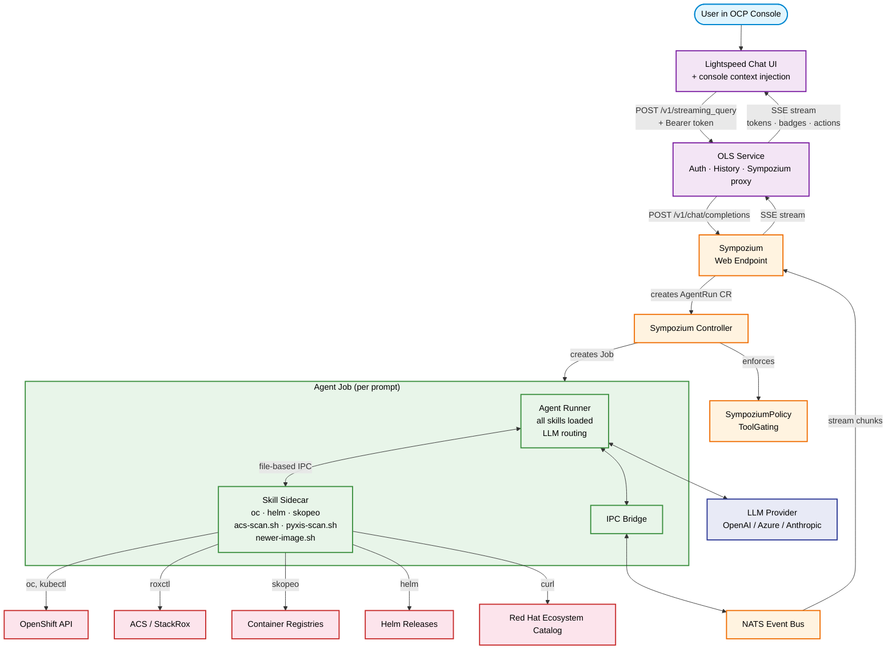
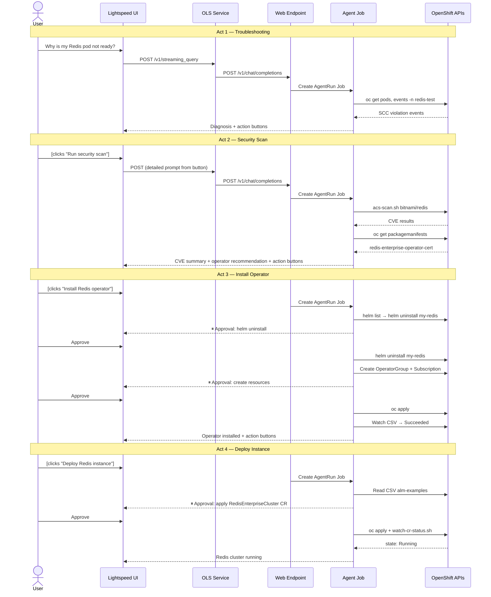

# OpenShift Lightspeed + Sympozium Multi-Agent Architecture

## Overview

This architecture extends OpenShift Lightspeed with Sympozium-ai to provide
an agentic, multi-skill experience for OpenShift cluster operations. A single
agent job handles each user prompt, with the LLM performing prompt-level
routing across domain-specific skills.

### Components

| Component | Role |
|-----------|------|
| **Lightspeed Console Plugin** | Chat UI with streaming tokens, tool-call badges, suggested-action buttons, and console context injection |
| **Lightspeed Service (OLS)** | FastAPI backend that authenticates users, manages conversation history, and proxies to Sympozium |
| **Lightspeed Operator** | Deploys and configures OLS Service + Console Plugin on OpenShift |
| **Sympozium Web Endpoint** | OpenAI-compatible API that translates chat requests into AgentRun CRs |
| **Sympozium Controller** | Reconciles AgentRun CRs into Kubernetes Jobs with skill sidecars |
| **Agent Runner** | Go binary inside each Job that calls the LLM, executes tools via IPC, and streams results |
| **Skill Sidecars** | Containers with domain-specific CLI tools (oc, helm, skopeo, acs-scan.sh, etc.) |
| **NATS** | Event bus for streaming chunks from agent Jobs back to the web endpoint |

### Skills (SkillPack CRs)

| SkillPack | Domain | Key Tools |
|-----------|--------|-----------|
| `openshift-platform` | Cluster health, nodes, operators, SCCs | oc, kubectl |
| `openshift-security` | RBAC, network policies, CVE scanning | oc, acs-scan.sh, pyxis-scan.sh |
| `openshift-observability` | Logs, events, metrics, pod diagnostics | oc, kubectl |
| `openshift-software-catalog` | Operator catalog, image versions, Helm charts | oc, helm, skopeo, newer-image.sh |

## Architecture: Single-Job with Prompt-Level Routing

Each user prompt creates **one** Kubernetes Job. All SkillPack skills are
loaded into the agent-runner as available tools. The LLM selects the
appropriate skill and tools based on the prompt context — no separate router
agent or subagent spawning is needed.



## Streaming Pipeline

Tokens flow from the LLM through the agent-runner to the user's browser
with minimal latency:

```
LLM → Agent Runner → stream-N.json (IPC) → NATS → Web Endpoint → SSE → OLS Service → SSE → Console UI
```

### Stream Chunk Types

| Type | Purpose | UI Rendering |
|------|---------|--------------|
| `token` | LLM response text | Streamed character-by-character |
| `tool_call` | Tool execution started | Badge appears (e.g., `oc get…`) |
| `tool_result` | Tool execution completed | Badge updated with status; transient status badges (`Analyzing`, `Reasoning`) are removed |
| `actions` | Suggested follow-up actions | Clickable buttons below the response |

### Visual Feedback

- **Tool badges**: Persistent PatternFly Labels showing each tool invocation.
  For `execute_command`, the badge displays a shortened command (e.g., `oc get…`).
  Clicking opens a modal with the full command and scrollable output.
- **Status badges**: Transient indicators (`Analyzing`, `Reasoning`) that
  appear during LLM processing and disappear when the phase completes.
- **Suggested actions**: Clickable buttons rendered from `__SYMPOZIUM_ACTIONS__`
  markers. Each button has a short label but submits a detailed prompt.

## Memory Persistence

The agent-runner emits `__SYMPOZIUM_MEMORY__...END__` markers in the LLM
response. These are:
1. Suppressed from the streamed output (never shown to the user)
2. Stored in a ConfigMap by the agent-runner
3. Loaded into the system prompt on subsequent prompts

This gives the agent persistent memory across chat turns without relying
on the LLM's context window for prior state.

## Console Context Injection

When the user is viewing a specific resource in the OpenShift Console
(e.g., a ClusterServiceVersion, Deployment, Pod), the Lightspeed Console
Plugin automatically prepends a context hint to the query:

```
[Context: User is viewing ClusterServiceVersion "openshift-pipelines-operator-rh.v1.21.0"
 in namespace "openshift-operators" in the OpenShift Console.]
```

This allows the agent to understand what the user is referring to without
requiring explicit YAML attachment.

## CVE Scanning

Two scanning backends with automatic fallback:

1. **ACS/StackRox** (`acs-scan.sh`): Discovers ACS in-cluster, syncs
   registry credentials from the global pull-secret, runs `roxctl image scan`.
2. **Pyxis** (`pyxis-scan.sh`): Falls back to the Red Hat Ecosystem Catalog
   API for Red Hat images when ACS is unavailable.

Default output is a severity summary. Detailed per-CVE tables are returned
only when the user explicitly asks.

## Sequence: Cross-Domain Redis Demo Flow


